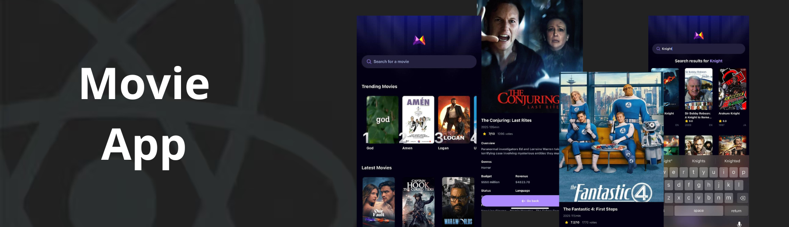

<div align="center">
  <br />



  <br />

  <div>
    
    
    
    
    
  </div>

  <h3 align="center">A Movie Finding App with Extensive Search</h3>

  
</div>

## 📋 <a name="table">Table of Contents</a>

1. 🤖 [Introduction](#introduction)

2. ⚙️ [Tech Stack](#tech-stack)

3. 🔋 [Features](#features)

4. 🤸 [Quick Start](#quick-start)


## <a name="introduction">🤖 Introduction</a>

Built with Expo, TypeScript, and Tailwind CSS, this app fetches movies and creates a popularity algorithm using Appwrite. It provides users with a seamless browsing experience, ranking movies based on various engagement metrics. The app leverages modern UI/UX principles for a responsive and visually appealing interface, ensuring real-world scalability and performance.


## <a name="tech-stack">⚙️ Tech Stack</a>

- **[Expo](https://expo.dev/)** is an open-source platform for building universal native apps (Android, iOS, web) using JavaScript/TypeScript and React Native. It features file-based routing via Expo Router, fast refresh, native modules for camera/maps/notifications, over-the-air updates (EAS), and streamlined app deployment.

- **[React Native](https://reactnative.dev/)** is a framework for building mobile UIs with React. It enables component‑based, cross-platform development with declarative UI, deep native API support, and is tightly integrated with Expo for navigation and native capabilities.

- **[Appwrite](https://jsm.dev/rn25-appwrite)** is an open-source backend-as-a-service platform offering secure authentication (email/password, OAuth, SMS, magic links), databases, file storage with compression/encryption, real-time messaging, serverless functions, and static site hosting via Appwrite Sites—all managed through a unified console and microservices architecture.

- **[TypeScript](https://www.typescriptlang.org/)** is a statically-typed superset of JavaScript providing type annotations, interfaces, enums, generics, and enhanced tooling. It improves error detection, code quality, and scalability—ideal for robust, maintainable projects.

- **[Tailwind CSS](https://tailwindcss.com/)** is a utility-first CSS framework enabling rapid UI design via low-level classes. In React Native/Expo, it’s commonly used with NativeWind to apply Tailwind-style utilities to mobile components.

- **[NativeWind](https://www.nativewind.dev/)** brings Tailwind CSS to React Native and Expo, allowing you to style mobile components using utility-first classes for fast, consistent, and responsive UI design.

## <a name="features">🔋 Features</a>

### Features of the Mobile Movie AppProject

👉 **Real-time data**: Fetching and displaying real-time movie data

👉 **Home Page**: Featured and discover movies

👉 **Search Page**: Search for your favorite movies

👉 **Popularity algorithm**: Track user searches to display the most popular movies

and many more, including code architecture and reusability.

## <a name="quick-start">🤸 Quick Start</a>

Follow these steps to set up the project locally on your machine.

**Prerequisites**

Make sure you have the following installed on your machine:

- [Git](https://git-scm.com/)

- [Node.js](https://nodejs.org/en)

- [npm](https://www.npmjs.com/) (Node Package Manager)

**Cloning the Repository**

```bash
git clone https://github.com/shabuj-alam/movie-app.git

cd movie-app
```

**Installation**

Install the project dependencies using npm:

```bash
npm install
```

**Set Up Environment Variables**

Create a new file named `.env` in the root of your project and add the following content:

```env

EXPO_PUBLIC_MOVIE_API_KEY=

EXPO_PUBLIC_APPWRITE_PROJECT_ID=

EXPO_PUBLIC_APPWRITE_DATABASE_ID=

EXPO_PUBLIC_APPWRITE_COLLECTION_ID=
```

Replace the placeholder values with your actual TMDB API key, Appwrite project ID, Database ID, and Collection ID. You can obtain these credentials by signing up on the [Appwrite](https://jsm.dev/rn25-appwrite), [TMDB](https://www.themoviedb.org/login).

**Running the Project**

```bash

npx expo start

```

Open your ExpoGO app on your phone and scan the QR code to view the project.

